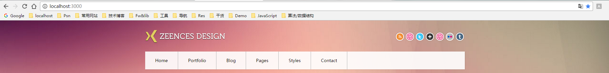
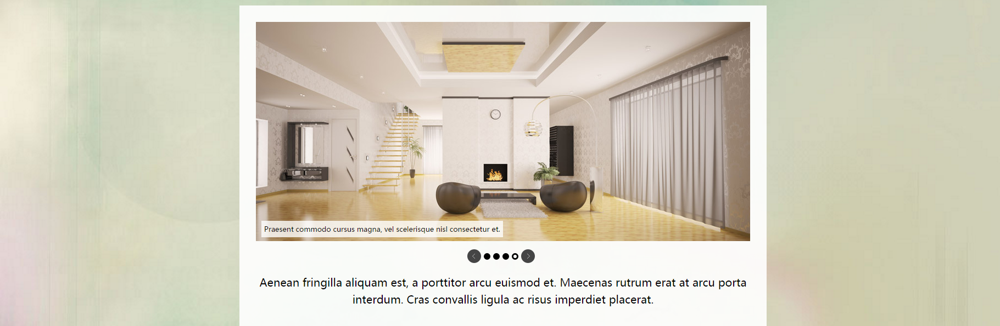
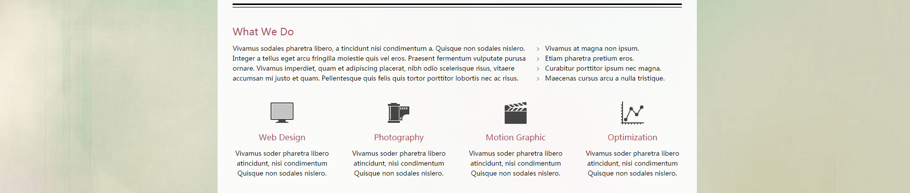
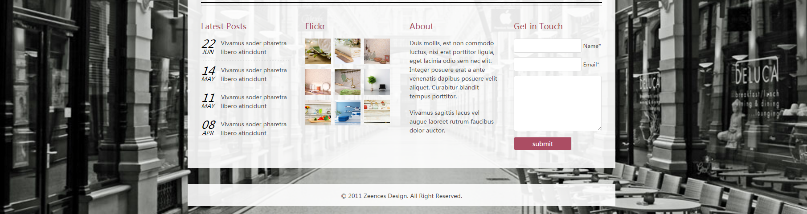

# MVC-demo
基于经典MVC模式，室内设计主页

### 运行
```
  node环境下执行: 
    node app.js
  
  浏览器地址栏输入：
    localhost:3000
```
## 预览
#### header模块
  菜单栏


#### home_banner模块
  轮播图


#### home_descpt模块
  详细信息


#### home_images模块
  左右轮播图


#### footer 模块
  页脚信息


### 技术栈
<pre>
MVC
jQuery
seaJs
</pre>
